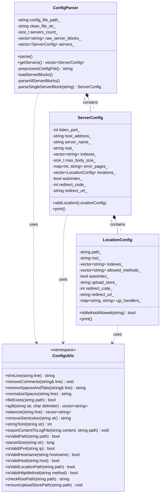

# Configuration Component UML

This diagram illustrates the structure and relationships of the configuration parsing components in `src/config`.

## Component Roles

- **ConfigParser**: Responsible for high-level parsing of the `.conf` file. It splits the file into server blocks and orchestrates the population of `ServerConfig` objects.
- **ServerConfig**: Data structure representing a single `server { ... }` block. Holds server-wide configuration such as port, host, and a collection of locations.
- **LocationConfig**: Data structure representing a `location { ... }` block within a server. Defines behavior for specific URI paths.
- **ConfigUtils**: A collection of utility functions for string manipulation, file checks, and type conversion used throughout the configuration component.
